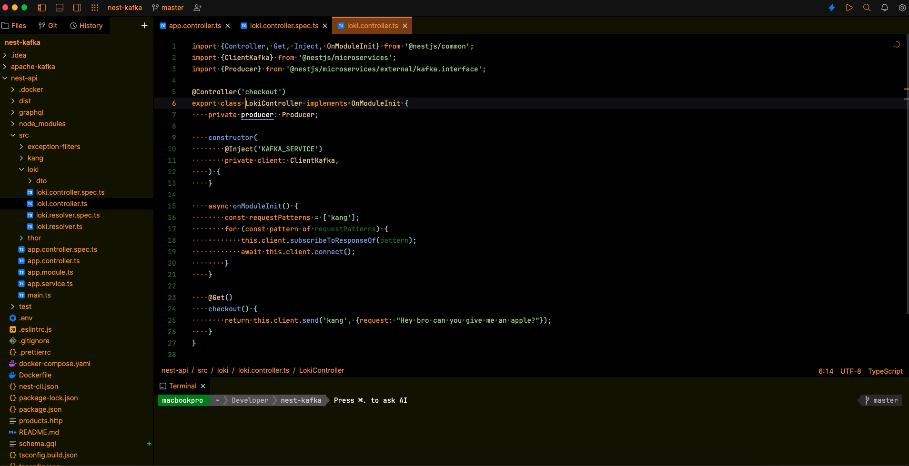

<h3 align="center">
     
    Theme for <a href="https://jetbrains.com/fleet">JetBrains Fleet</a>
</h3> 

    

    

## Usage

1. Clone this repository locally
2. Go to `~/.fleet`
3. Create a `themes` folder if not already present
4. Copy the content of the [themes](themes/) folder in the `themes` folder created before

&nbsp;

    Copyright &copy; 2021-present <a href="https://github.com/tamert" target="_blank">Tamer Agaoglu</a>

    

